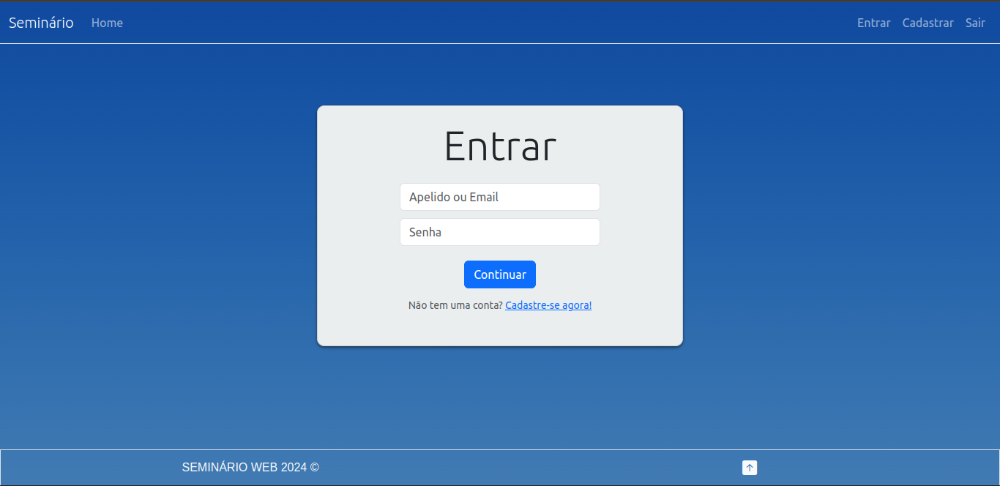
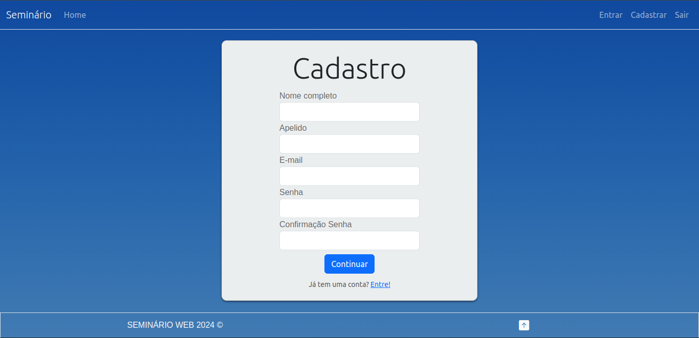
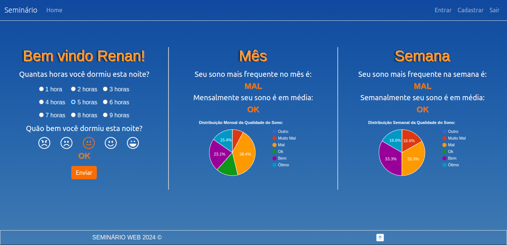

# Seminario Web 
## Descrição:
Um simples web app desenvolvido utilizando HTML, CSS, Bootstrap, Javascript, PHP e XAMPP, implementa funcionalidades básicas de cadastro e login. Usuários conseguem inserir dados sobre o sono e o app oferece a visualização de médias mensais e semanais em um gráfico de pizza.

## Exemplos:
|Login| Cadastro | Display |
|---------|---------|---------|
|  |  |  |

## Database:
1. Crie uma nova mysql database (default name = "seminario-project" modificar em config.php)
2. Importe o sql schema (seminario-project.sql) usando phpmyadmin ou mysql cli.
### phpmyadmin
1. Selecione a nova database
2. Clique em import
3. Selecione o arquivo schema (seminario-project.sql)
### mysql cli
1. mysql -u localhost -p seminario-project < path/seminario-project.sql